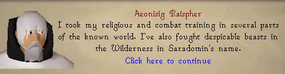
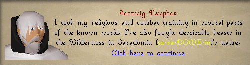
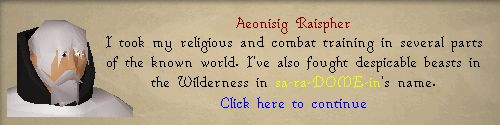
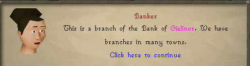
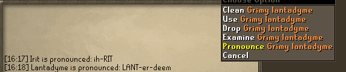

# Pronunciation Helper
This plugin will show official pronunciation of words in dialogue with npcs. It additonally supports the option to add right click menu options to eligible items and NPC's.

All pronunciations are taken from Runescape official pronunciation guide: https://runescape.wiki/w/Transcript:Pronunciation_guide

Options:
- Pronunciation Color: Sets the color of the pronunciation text shown in dialogue.
- Always Show pronunciation: If enabled, the pronunciation will always be shown in dialogue. 
If disabled, it will only show when the pronunciation Hotkey key is held down.

- Pronunciation Hotkey: A key to be held down that will replace the qualifying word with its pronunciation directly, as opposed to in brackets beside the word

For example, if you disable always show pronunciation, when the hotkey is held, the word will be replaced dynamically with its pronunciation in pronunciation colour untill released.
- Highlight Eligible Words: If enabled, all words that have a pronunciation available will be highlighted in dialogue with the specified color. Ignored if Always Show Pronunciation is enabled

- Pronunciation Highlight Color: Sets the color of the highlighted eligible words in dialogues, given Highlight Eligible Words is enabled.
- Show Right Click Option: When enabled, adds a right click "pronounce" option to npc or item names that have a pronunciation available, including substrings of the word. This will generate a chatbox message with how to pronounce the word (i.e, both Grimy Lantadyme and Lantadyme will have a pronounce option for Lantadyme)

Notes:
This plugin is likely not compatible with other plugins that modify dialogue.
